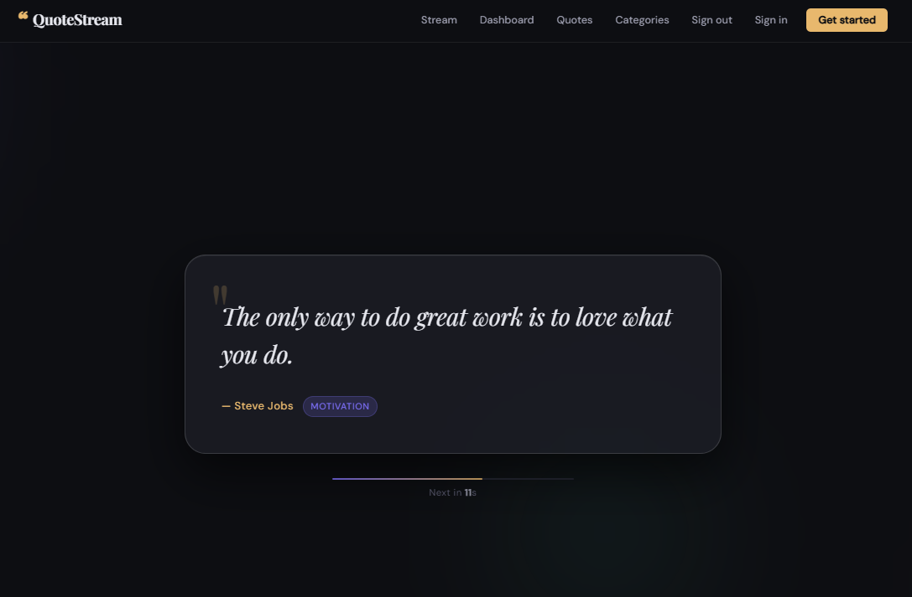
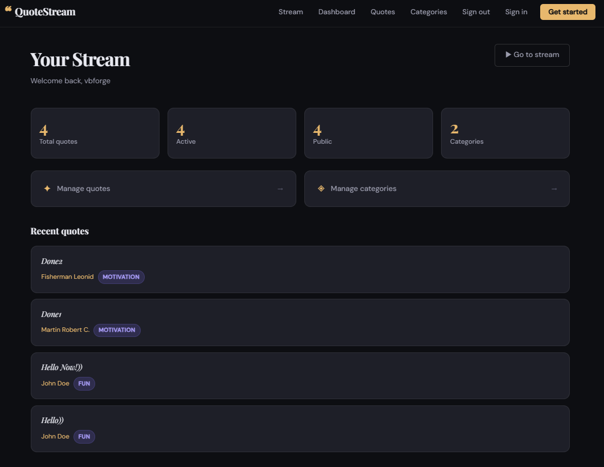
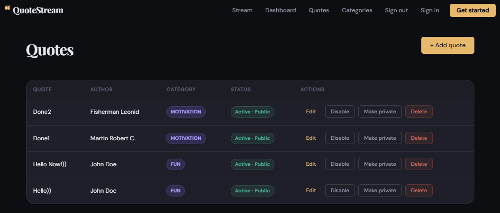
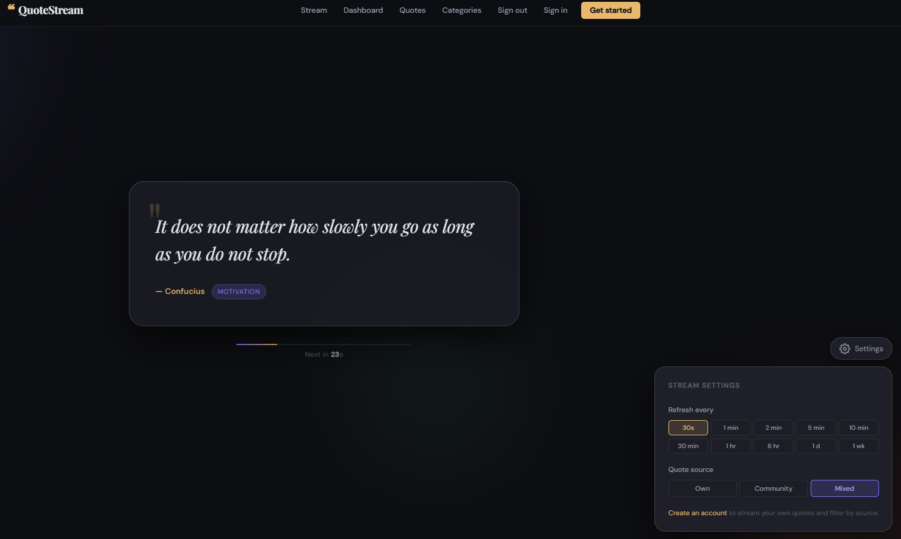

# QuoteStream

A dark-themed quote streaming web app built with Spring Boot, Thymeleaf, and PostgreSQL.

## Features

- 🌊 Auto-refreshing quote stream (configurable interval: 30s → 1 week)
- 👤 User registration & authentication (Spring Security + BCrypt)
- 📚 Full CRUD for quotes and categories (per-user)
- 🔍 Three streaming modes: **Own** / **Community** / **Mixed**
- 🔒 Public/private quotes, active/inactive toggle
- 📱 Fully responsive (mobile, tablet, desktop)
- 🐳 Docker + Docker Compose ready

## Quick start (Docker)

```bash
cp .env.example .env
# edit .env if needed

docker-compose up --build
```

Then open **http://localhost:8080**

Demo account: `demo` / `demo123`

## Quick start (local dev)

Prerequisites: Java 17+, Maven, PostgreSQL running locally

```bash
# Set env vars (or edit application.properties)
export DB_URL=jdbc:postgresql://localhost:5432/quotestream
export DB_USER=quotestream
export DB_PASSWORD=quotestream

mvn spring-boot:run
```

## Project structure

```
src/main/java/com/quotestream/
├── config/          SecurityConfig
├── controller/      Auth, Stream, Dashboard, Quote, Category
├── dto/             Request/Response DTOs
├── model/           User, Quote, Category, StreamSettings
├── repository/      Spring Data JPA repos
└── service/         Business logic

src/main/resources/
├── db/migration/    Flyway SQL migrations
├── static/css/      main.css
├── static/js/       (inline in templates)
└── templates/       Thymeleaf pages
```

## Stream modes

| Mode      | Shows                                  |
|-----------|----------------------------------------|
| Own       | Your quotes only (filter by category)  |
| Community | All public quotes from all users       |
| Mixed     | Your quotes + all public quotes        |

## Tech stack

- Java 17 · Spring Boot 3.2
- Spring MVC · Spring Security · Spring Data JPA
- Thymeleaf · Flyway · PostgreSQL
- Docker · Docker Compose

## Deployment

See [DEPLOY.md](DEPLOY.md) for Railway / Render / Fly.io instructions.

## Screenshots





